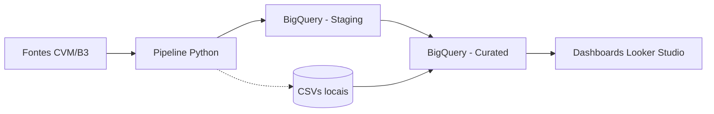

# Siglo Fundos – Pipeline de Dados

Este repositório implementa um pipeline mensal para ingestão de dados públicos da CVM e fontes complementares (B3 e fallback manual do Mais Retorno). O objetivo é alimentar tabelas no BigQuery organizadas em camadas **staging** e **curated**, servindo como base para dashboards no Google Looker Studio.

## Pré-requisitos

- Python 3.11+ instalado localmente.
- (Opcional) [Google Cloud SDK](https://cloud.google.com/sdk/docs/install) para validação de credenciais.
- Conta de serviço com permissões de `BigQuery Data Editor` e `BigQuery Job User`.
- Chave JSON da conta de serviço salva localmente e disponibilizada como segredo no GitHub (`BIGQUERY_SERVICE_ACCOUNT`).

## Acessando os arquivos deste projeto

Se você está utilizando este ambiente hospedado (por exemplo, via navegador), há três maneiras comuns de copiar o código para o seu computador:

1. **VS Code + Dev Containers**
   - Instale o [VS Code](https://code.visualstudio.com/) e a extensão **Dev Containers** (ou **Remote - Containers**).
   - Abra o VS Code e pressione `Ctrl+Shift+P` (ou `Cmd+Shift+P` no macOS) para abrir a *Command Palette*.
   - Digite `Dev Containers: Attach to Running Container` e selecione o container correspondente. *Esse passo é feito na interface do VS Code; não execute o texto como comando no terminal do Windows.*
   - Após o VS Code conectar ao container, navegue até `/workspace/SigloFundos` no painel *Explorer* para editar e copiar arquivos.

2. **Download em ZIP**
   - No terminal deste ambiente, execute:
     ```bash
     cd /workspace
     zip -r SigloFundos.zip SigloFundos
     ```
   - Faça o download do arquivo `SigloFundos.zip` pelo recurso de transferência de arquivos da plataforma e descompacte localmente.

3. **Publicar em um repositório seu**
   - Crie um repositório vazio no GitHub.
   - No terminal deste ambiente, execute:
     ```bash
     cd /workspace/SigloFundos
     git remote add origin https://github.com/<seu-usuario>/SigloFundos.git
     git push -u origin main
     ```
   - Em seguida, clone normalmente a partir do repositório que você acabou de criar.

## Configuração do ambiente

1. Clone o repositório e instale as dependências:

   ```bash
   python -m venv .venv
   source .venv/bin/activate
   pip install -r requirements.txt
   ```

2. Copie o arquivo de configuração padrão e ajuste conforme necessário:

   ```bash
   cp config/pipeline.yaml config/pipeline.local.yaml
   ```

   Campos principais:

   - `meses_retroativos`: quantidade de meses de histórico a baixar.
   - `fundos`: lista de fundos monitorados (CNPJ, nome, categoria CVM, gestora, classe Anbima e agrupamento para dashboards).
   - `categorias_looker`: mapeamentos adicionais para agrupamentos no Looker Studio.
   - `bigquery_*`: identificadores do projeto e datasets.
   - `enable_b3_ingestion` / `b3_planilhas`: planilhas oficiais da B3 (URLs ou caminhos locais) para complementar dados de fundos imobiliários.
   - `enable_mais_retorno_fallback`: habilita alertas para execução manual do fallback via Mais Retorno.

3. Configure as variáveis de ambiente criando um arquivo `.env` na raiz:

   ```bash
   GOOGLE_APPLICATION_CREDENTIALS=/caminho/para/sua-chave.json
   PIPELINE_LOG_LEVEL=INFO
   ```

4. Certifique-se de armazenar o mesmo arquivo de credenciais como segredo no GitHub (`BIGQUERY_SERVICE_ACCOUNT`). O workflow mensal carrega o conteúdo do segredo e gera o arquivo JSON antes da execução.

## Como executar localmente

Os comandos abaixo utilizam o módulo principal `data_pipeline.run_pipeline` e podem ser executados com `python -m`:

```bash
# Executa todas as etapas e realiza upload para o BigQuery
python -m data_pipeline.run_pipeline ingest --config-path config/pipeline.local.yaml

# Gera apenas os CSVs locais (diretórios output/staging e output/curated)
python -m data_pipeline.run_pipeline export-local --config-path config/pipeline.local.yaml

# Reutiliza CSVs existentes no diretório output/ e envia para o BigQuery
python -m data_pipeline.run_pipeline upload-bigquery --config-path config/pipeline.local.yaml
```

Os CSVs intermediários ficam organizados em:

```
output/
├── staging/   # tabelas brutas (fato e dimensões)
└── curated/   # agregações prontas para dashboards
```

## Estrutura das tabelas entregues

### Camada staging

- `fato_cota_diaria`: valores de cota, patrimônio e movimentos diários por CNPJ.
- `fato_carteira_mensal`: composição da carteira mensal por ativo.
- `fato_cotistas_mensal`: total de cotistas e patrimônio mensal.
- `dim_fundo`: cadastro dos fundos monitorados com metadados (gestora, classe, grupo Looker).
- `dim_gestora`, `dim_categoria_cvm`, `dim_classe_anbima`: dicionários auxiliares.

### Camada curated

- `curated_cotas_por_categoria`: média de cota e soma de patrimônio por categoria CVM.
- `curated_cotas_por_gestora`: agregações por gestora.
- `curated_cotas_por_grupo_looker`: agregações pelos grupos usados no Looker Studio.

Cada CSV contém cabeçalho e utiliza separador padrão (vírgula). Datas são armazenadas em formato ISO (`YYYY-MM-DD`).

## Conectando no Looker Studio

1. No Looker Studio, crie uma nova fonte de dados do tipo **BigQuery**.
2. Selecione o projeto, o dataset (`staging` ou `curated`) e a tabela desejada.
3. Ative a atualização automática (cache) conforme a necessidade.
4. Utilize os campos `categoria_cvm`, `gestora` ou `grupo_looker` para aplicar filtros dinâmicos nas visualizações.

## Estrutura de diretórios principais

```
data_pipeline/
├── common/         # utilitários compartilhados (download, BigQuery, normalização)
├── cvm/            # rotinas para InfDiario/InfMensal e dimensões
├── b3/             # ingestão opcional de planilhas da B3
└── mais_retorno/   # fallback manual com checagem de termos de uso
```

## GitHub Actions

O workflow `.github/workflows/monthly_ingest.yml` executa mensalmente (e pode ser disparado manualmente) as seguintes etapas:

1. Configura o Python 3.11 e instala dependências.
2. Reconstrói o arquivo de credenciais do BigQuery a partir do segredo `BIGQUERY_SERVICE_ACCOUNT`.
3. Executa `python -m data_pipeline.run_pipeline ingest --skip-bigquery` para gerar os CSVs.
4. Faz upload dos artefatos (`output/`) para consulta rápida.
5. Executa novamente o upload para o BigQuery utilizando as credenciais carregadas.

> **Importante:** antes de habilitar o workflow, confirme que os segredos `BIGQUERY_SERVICE_ACCOUNT`, `BIGQUERY_PROJECT`, `BIGQUERY_DATASET_STAGING`, `BIGQUERY_DATASET_CURATED` e `GCS_BUCKET` estão configurados no GitHub.

## Diagrama do fluxo



## Boas práticas adicionais

- Utilize `ruff` (`ruff check .`) e `black` (`black .`) para manter o estilo de código consistente.
- Os logs são configurados com formato padronizado e podem ser ajustados via `PIPELINE_LOG_LEVEL`.
- Quando fontes externas estiverem indisponíveis, as mensagens de erro indicam a URL afetada. Revise os artefatos gerados para identificar meses faltantes.

## Testes

Execute os testes unitários com:

```bash
pytest
```

Eles validam partes críticas da normalização e do parsing dos arquivos comprimidos da CVM.
